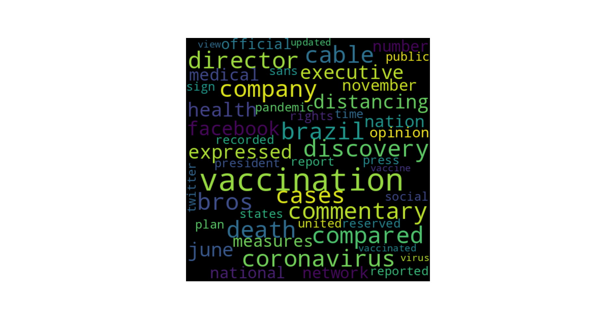

# News Analysis

News Analysis is a tool for providing brief insight into one news topic. It aims to give the users a general idea about the top words around one topic and if authors in news media have negative or positive opinions on it. This tool is developed to provide a first glimpse of the new topics to embrace a rough insight. It can also help users to give a sound idea. Just imagine you hear a topic and are curious about it. Other than reading long, retailed and maybe tedious articles, you can use this tool to get top keywords first. It will not only make you decide if you are interested in this topic but also make you read articles more smoothly.

## Installation

Installing News Analysis tool requires a version of Python greater than 3.8. Because it's a personal project still in development and is only accessible to a small number of people, it's not uploaded to `PyPI`. Therefore, the only way to use this project is by cloning it in github and executing `poetry install` command to add necessary packages. Most importantly, the `Chrome` browser is required to call the' Selenium' package successfully.

## Usage of News Analysis

A ChromeDriver greater than 102 is required. Please download the current version of ChromeDriver in [this website](https://chromedriver.chromium.org/downloads) based on your OS system and Chrome version. You can check the Chrome version in the `settings` of Chrome. Please extract your ChromeDriver to the directory named `drivers` in the root directory.

To use this tool, run the `poetry install` in the root directory to create a virtual environment and then execute `cd news_analysis` to the correct running path. Finally, run `poetry run python main.py SEARCH_WORDS` Within `SEARCH_WORDS` are the topics you want to explore and it should be in the Snake case if there are is than one word

Also if you have the prefer media, you can specify it by adding `--search-media MEDIA` following the previous command.
Until now, this tool accepts three media **CNN**, **NBC** and **Reuters**. Please feel free to select any of them with the right name and case.

An example below

```bash
yanqiao@a:~/News_analysis/news_analysis$ poetry run python3 main.py covid_China  --search-media CNN
```

Then after about 1 minute, sentiment analysis result like below will show up:

```bash
😆, Here is the sentiment analysis result
{'neg': 0.034, 'neu': 0.884, 'pos': 0.082, 'compound': 0.4404}
```

As well as a wordcloud which represents the top features.



## More

- The process of calling package `Selenium` takes time and isn't stable. Please be patient. If the terminal doesn't prompt anything for more than 1 minutes, please shut it down and re-execute with the sample command. It happens sometimes.
- Please make sure the topic you choose exists. Right nwo the tool hasn't yet had the ability to show up failure message because the developer believes this situation is minor and can be avoid manually
- This tool is still in development, please expect it to be cooler. There are some aspects can be improved and the developer is working on
  - add topic modeling analysis feature
  - overcome the instability from the usage of `Selenium`
  - add more news media to explore more widely
  - add tests

## The Personal Summary of This Project

News Analysis is my first personal medium-size project. Compared with other cool projects online, it may be tiny and simple, but I still feel it's a good start to my journey as a CS worker. Unlike the ones I was required to make as the final projects for the courses, News Analysis is a project strictly coded by myself.  
In the very beginning, the initial idea emerged when I read the news during the pandemic. I found it tedious to read the lengthy articles in English as a person whose first language is not it. I got lost quickly. Then an idea came to my mind why don't I create a tool to extract the keywords so that people can avoid reading lengthy articles or at least read them more easily with keywords in mind.  
Then I signed up for the Cupper Scholarship in the cs department of Allegheny College. After updating and fixing my proposal for more than 5 times in 2 months. I finally got admitted and received the opportunity to transform my idea into a concrete project.  
Things aren't as smooth as I thought. Continuous 8-hour work was far from easy, and the codes always crashed in weird ways. Then sadly, after about 2 weeks, I decided to break for about 10 days because of the headache occurring when I stared at the screen.  
Despite that, life isn't always around frustrations. Challenge makes people stronger. After reading a variety of blogs, articles and watching youtube videos, I did overcome the challenges step by step. I do remember one of the biggest ones is about searching articles. By imitating the search in the news platform, I decided to work with BeautifulSoup and try to get into the URL with the appropriate query and then extract the links in the HTML.
Nevertheless, a blank HTML was returned by it. I am so confused, especially when I could get the correct page and content with the same URL in the Chrome browser. After struggling for hours, I eventually discovered the page was dynamic and written by JavaScript recursively and therefore has no static HTML in a blog. Then a new library called Selenium showed up before me and solved the problem smoothly.  
I do know there are a bunch of defects in News Analysis. The time consumption is high. The test is not done and more and more. But still, I feel comfortable about it. Come on, it's my first project and I did try my best, so no matter what, it does work as expected. So why don't I take it as a tiny achievement in my whole CS career? Wish I could create more cool projects in the future.  
Finally, thanks to all the people supporting me during this project and the developers contributing to the excellent open-source libraries. Special thanks to Professor Gregory M. Kapfhammer (my advisor) and Mrs. Sandy Cupper (my sponsor)
